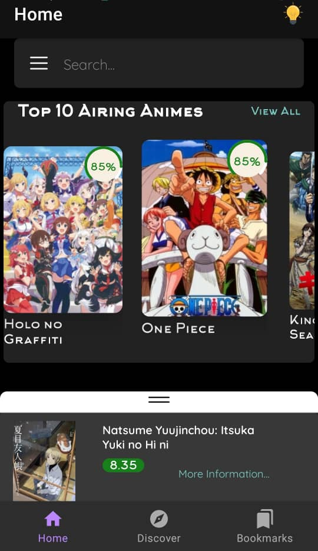
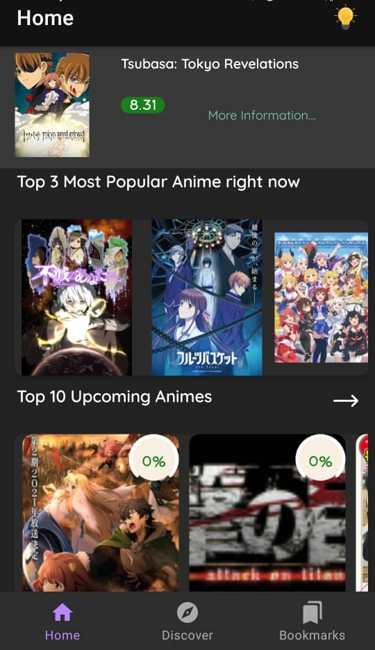
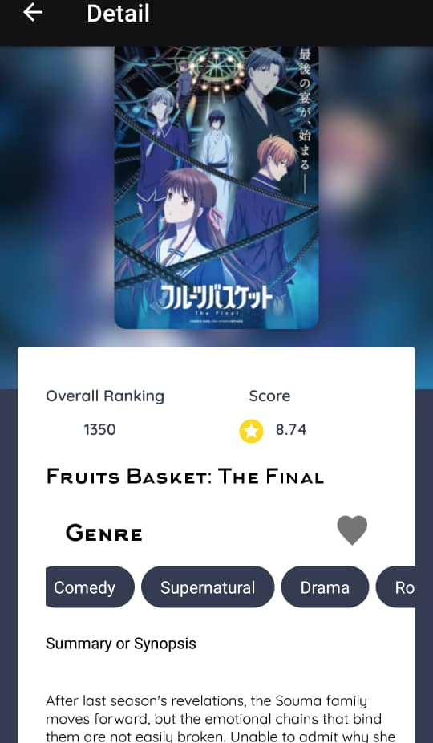
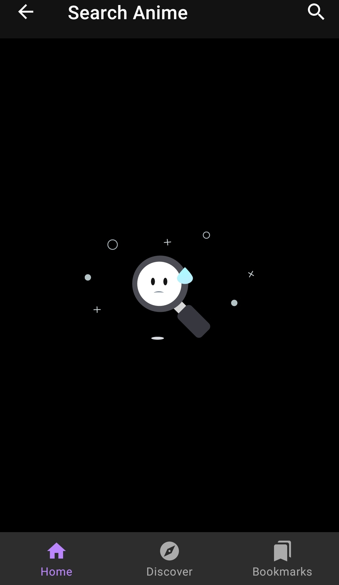

# Manga-List-CleanArchitecture

[](https://www.android.com)
[](https://android-arsenal.com/api?level=22)
[](https://opensource.org/licenses/MIT)

Manga List is an app that gives you information on the most popular animes, as well as the upcoming ones.

This Android application using MVVM, Clean Architecture, Android Architecture Components.

Made in Kotlin and Java

<a name="description"></a>

## Challenge description

- Load most popular animes.
- Ability to search news by keyword.
- Light/Dark mode.
- Show animes with the following details :
  - Anime Title.
  - Anime Description.
  - Anime Rating.
  - Anime ranking.
  - Anime trailers.
- Using Jikan API to retrieve news that matches the search
- Save/Delete Bookmarks in database with Room/LiveData

<a name="screenshots"></a>

## Screenshots

#### Screenshots

<table style="width:100%">
  <tr>
    <th>1. Home</th>
    <th>2. Home</th>
    <th>3. Detail</th>
    <th>4. Search</th>
  </tr>
  <tr>
    <td></td>
    <td></td>
    <td></td>
    <td></td>
  </tr>
   </table>

<a name="specifications"></a>

## Specifications

- [x] Bookmark option
- [x] Retrieve varrious types of animes(popular, upcoming, movies etc..).
- [x] Realtime search and sorting speed
- [x] Clean design
- [x] Descriptive Git history
- [x] Discover new animes by season
- [x] Light/Dark Theme
- [ ] Monitor connectivity status
- [x] MVVM/Clean Architecture
- [ ] Unit tests.
- [ ] Home Layout must be configured for all devices.

<a name="tools"></a>

## Languages, libraries and tools used

- [Timber](https://github.com/JakeWharton/timber)
- [Logger](https://github.com/orhanobut/logger)
- [Kotlin](https://kotlinlang.org/)
- [AndroidX libraries](https://developer.android.com/jetpack/androidx)
- [Android Architecture Components](https://developer.android.com/topic/libraries/architecture) : [Lifecycle](https://developer.android.com/topic/libraries/architecture/lifecycle), [LiveData](https://developer.android.com/topic/libraries/architecture/livedata), [Room](https://developer.android.com/jetpack/androidx/releases/room), [ViewModel](https://developer.android.com/topic/libraries/architecture/viewmodel)
- [Moshi](https://github.com/square/moshi)
- [View Binding](https://developer.android.com/topic/libraries/view-binding)
- [Dagger-Hilt](https://developer.android.com/training/dependency-injection/hilt-android)
- [Picasso](https://github.com/square/picasso)
- [Glide](https://github.com/bumptech/glide)
- [Retrofit2](https://github.com/square/retrofit)
- [Android Test Support Library](https://developer.android.com/training/testing/index.html)
- [Lottie](https://github.com/airbnb/lottie-android)
- [Coil](https://github.com/coil-kt/coil)
- [Percentage View](https://github.com/turkergoksu/PercentageView)
- [Like Button](https://github.com/jd-alexander/LikeButton)
- [Sneaker](https://github.com/Hamadakram/Sneaker)
- [Looping ViewPager](https://github.com/siralam/LoopingViewPager)
- [Facebook Shimmer](https://github.com/facebook/shimmer-android)
- [Material Chip View](https://github.com/robertlevonyan/material-chip-view)
- [Zoom Recycler Layout](https://github.com/Spikeysanju/ZoomRecylerLayout)
- [Circle Image View](https://github.com/hdodenhof/CircleImageView)


<a name="requirements"></a>

## Requirements

- min SDK 22

<a name="contribute"></a>

## Contribute

Let's develop with collaborations. We would love to have contributions by raising issues and opening PRs. Filing an issue before PR is must.
See [Contributing Guidelines](CONTRIBUTING.md).

<a name="license"></a>

## License

MIT License

```
Copyright (c) [2021] [Rachid Insa]
Permission is hereby granted, free of charge, to any person obtaining a copy
of this software and associated documentation files (the "Software"), to deal
in the Software without restriction, including without limitation the rights
to use, copy, modify, merge, publish, distribute, sublicense, and/or sell
copies of the Software, and to permit persons to whom the Software is
furnished to do so, subject to the following conditions:

The above copyright notice and this permission notice shall be included in all
copies or substantial portions of the Software.

THE SOFTWARE IS PROVIDED "AS IS", WITHOUT WARRANTY OF ANY KIND, EXPRESS OR
IMPLIED, INCLUDING BUT NOT LIMITED TO THE WARRANTIES OF MERCHANTABILITY,
FITNESS FOR A PARTICULAR PURPOSE AND NONINFRINGEMENT. IN NO EVENT SHALL THE
AUTHORS OR COPYRIGHT HOLDERS BE LIABLE FOR ANY CLAIM, DAMAGES OR OTHER
LIABILITY, WHETHER IN AN ACTION OF CONTRACT, TORT OR OTHERWISE, ARISING FROM,
OUT OF OR IN CONNECTION WITH THE SOFTWARE OR THE USE OR OTHER DEALINGS IN THE
SOFTWARE.
```
